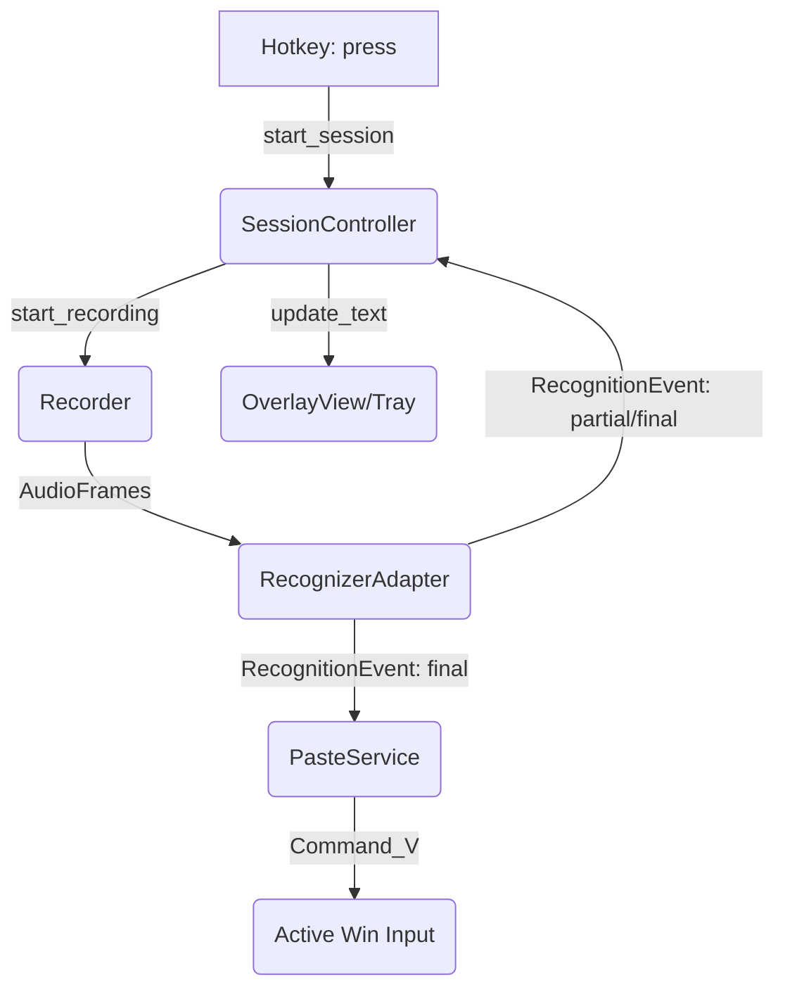

# chat2word

这是一个正在建设中的 macOS 平台实时语音转文字辅助工具。它能够常驻于系统托盘，监听全局快捷键进行录音，并将语音实时通过阿里云千问 API 转换为文本，最终自动粘贴至用户光标所在输入框。

## 核心特性设计
- 🎧 全局快捷键录音控制 (如 `Option` 键组合长按)
- ☁️ 基于阿里云 DashScope `qwen3-asr-flash` 实现流式、高精度、低延迟中文识别
- 🪄 悬浮半透明 UI 实时展示短句中间识别态
- 📋 增强型剪贴板管理：自动完成上屏而不丢失用户的旧剪贴板内容

## 项目进度 (MVP 化阶段)
当前项目正处于基础设施建设前期的架构设计规划完成节点，以下文档沉淀了本次实施的路线与策略：
- [`技术路线.md`](./技术路线.md): 规划了采用 Python + PySide6 的全局技术体系、线程模型及 MVP V2 演进决策。
- [`功能详细设计.md`](./功能详细设计.md): 从 SessionController、HotkeyAdapter 到 PasteService 等 7 大模块的 I/O、失败恢复、超时设计。
- [`测试方案.md`](./测试方案.md): 分为 Unit / Integration / E2E / Manual 的多维测试防护网与 Github CI 接入规范。

## 快速浏览核心架构 (Draft)

